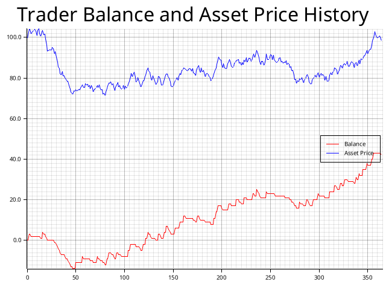

# Cryptocurrency Trading Simulator

This Rust program simulates a virtual trader's activity on a cryptocurrency exchange over the course of a year (365 days).

The simulation models the daily price fluctuations of a cryptocurrency and tracks the trader's balance based on their trading decisions.

The price changes completely randomly without any patterns. This is not a realistic market simulation, but it shows how a trader's balance changes with a completely random price change.

## Features

Daily Price Fluctuation: The program emulates the cryptocurrency's price changes in a random direction each day, simulating the volatility of the market.

Trading Strategy: At the start of the simulation, the virtual trader enters a long position with a predefined stop-loss set at 1% below the current price and a take-profit set at 3% above the current price.

Trade Execution: The trader's position is monitored daily, and the trade is executed (profit or loss is realized) when the price hits either the stop-loss or take-profit levels.

Balance Tracking: The trader's balance is updated based on the outcome of each trade, and the history of the balance is recorded throughout the simulation.

Graphical Output: Upon completion of the simulation, a graph is generated displaying the trader's balance history over the 365-day period. 



- Red Line: Represents the trader's balance history over the simulation period.
- Blue Line: Represents the daily price changes of the cryptocurrency.


## Usage

To run the simulation, ensure you have Rust installed on your system. Clone the repository, navigate to the project directory, and execute the following command:

```bash
cargo run
```

After the simulation completes, the graph `balance_history.png` will be saved in the project directory. Open this file to view the graphical representation of the trader's balance history and the asset's price changes.


## Disclaimer

This program is for simulation purposes only and does not represent real trading conditions or guarantee any financial outcomes. It is intended to demonstrate the potential impact of market volatility on trading strategies.

